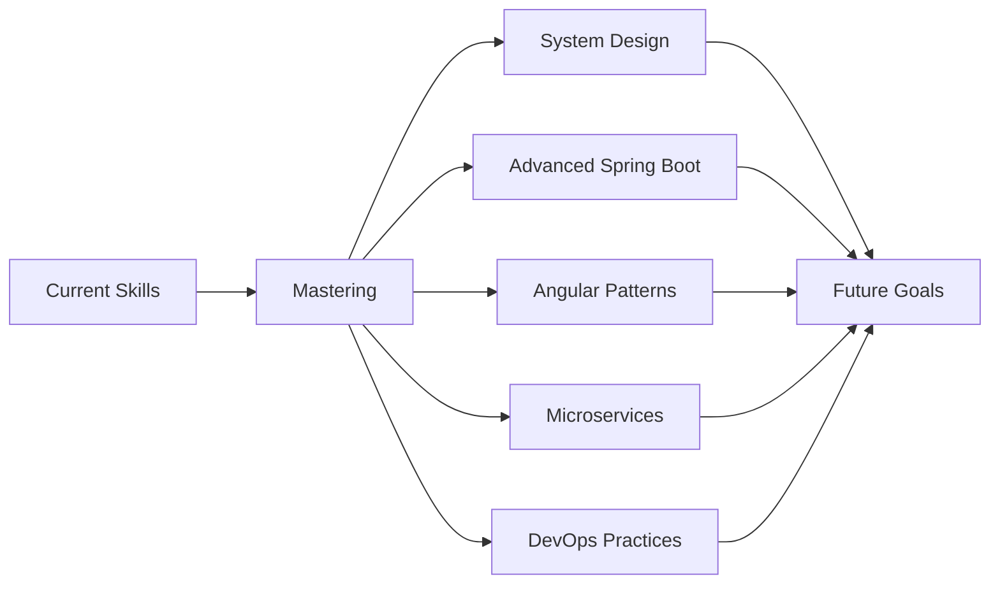

<div align="center">
  
# 🚀 Tasheen Darshika

[](https://git.io/typing-svg)

<p align="center">
  <a href="https://github.com/Tasheen2002"></a>
  <a href="https://linkedin.com/in/yourprofile"></a>
  <a href="mailto:your.email@example.com"></a>
</p>


</div>

---

## ✨ About Me

```typescript
const tasheen = {
    name: "Tasheen Darshika",
    role: "Software Engineering Intern",
    education: "Software Engineering Undergraduate",
    currentWork: "Enterprise Apparel E-Commerce Platform",
    completedProjects: [
        "Cosmetics E-Commerce Platform",
        "Fuel Management System", 
        "Expense Tracker Application"
    ],
    architecture: ["MERN Stack", "Modular Monolithic", "Full-Stack Development"],
    techStack: {
        frontend: ["React", "Next.js", "TypeScript"],
        backend: ["Node.js", "Express.js", "Java Spring Boot"],
        database: ["MongoDB", "PostgreSQL", "MySQL", "Prisma ORM"],
        learning: ["Go", "Microservices Architecture"]
    },
    interests: ["System Design", "Clean Architecture", "Performance Optimization"],
    motto: "Building scalable, maintainable systems one commit at a time"
};
```

🎯 **Current Focus:**
- 🔥 **Currently Working:** Enterprise-level Apparel E-Commerce Platform
- 🛒 **Completed Projects:** Cosmetics E-Commerce, Fuel Management System, Expense Tracker
- ⚡ Building full-stack applications with MERN stack and TypeScript
- ☕ Working with Java Spring Boot for backend services
- 🚀 Learning Go for high-performance backend development

---

## 🛠️ Tech Stack

<div align="center">

### Frontend Development


### Backend Development


### Databases & ORMs


### Tools & Platforms


</div>

---

## 📈 GitHub Statistics

<div align="center">
  


</div>

<div align="center">
  
  
</div>

<div align="center">
  


</div>

---

## 🏆 Featured Projects

<details>
<summary>👔 <b>Enterprise Apparel E-Commerce Platform</b> - 🔥 Currently Working</summary>
<br>

**Tech Stack:** TypeScript, Next.js, Node.js, Express.js, MongoDB/PostgreSQL, Prisma

A full-scale enterprise e-commerce solution for apparel retail:
- ✅ Modular monolithic architecture for scalability
- ✅ Advanced product catalog with filtering and search
- ✅ User authentication and authorization
- ✅ Shopping cart and order management
- ✅ Admin dashboard for inventory management
- ✅ RESTful API with type-safe endpoints
- ✅ Responsive design for all device sizes

**Status:** 🚧 In Active Development

</details>

<details>
<summary>💄 <b>Cosmetics E-Commerce Platform</b></summary>
<br>

**Tech Stack:** MERN Stack (MongoDB, Express.js, React, Node.js), TypeScript

Modern e-commerce platform specialized for cosmetics and beauty products:
- ✅ Dynamic product pages with detailed descriptions
- ✅ Customer review and rating system
- ✅ Wishlist and favorites functionality
- ✅ Secure payment gateway integration
- ✅ Real-time inventory tracking
- ✅ Mobile-first responsive design
- ✅ Category-based product organization

**Status:** ✅ Completed

</details>

<details>
<summary>⛽ <b>Fuel Management System</b></summary>
<br>

**Tech Stack:** TypeScript, Next.js, Node.js, Express.js, PostgreSQL, Prisma

Comprehensive fuel management solution for fleet operations:
- ✅ Vehicle fuel consumption tracking
- ✅ Real-time fuel expense monitoring
- ✅ Report generation for fleet analytics
- ✅ Driver and vehicle assignment management
- ✅ Fuel efficiency metrics and insights
- ✅ Multi-user role-based access control
- ✅ Data visualization with charts and graphs

**Status:** ✅ Completed

</details>

<details>
<summary>💰 <b>Expense Tracker Application</b></summary>
<br>

**Tech Stack:** TypeScript, Next.js, Prisma, PostgreSQL

A full-stack expense tracking application with modern architecture:
- ✅ Real-time expense tracking and categorization
- ✅ Interactive dashboards with data visualization
- ✅ Type-safe API routes with TypeScript
- ✅ Database modeling with Prisma ORM
- ✅ Budget planning and financial insights
- ✅ Export functionality for reports
- ✅ Responsive UI with modern design patterns

**Status:** ✅ Completed

</details>

---

## 💡 What I'm Learning



**Current Learning Path:**
- 🎯 Advanced System Design Patterns
- 🔥 Microservices Architecture with Node.js & Go
- ⚡ Advanced React Patterns & State Management
- ☕ Spring Boot Best Practices & Design Patterns
- 🐹 Go Programming Language & Concurrency
- 🐳 Docker & Container Orchestration
- 📊 Database Optimization & Performance Tuning
- 🔐 Authentication & Security Best Practices

---

## 📫 Connect With Me

<div align="center">

**Let's build something amazing together!**

[](https://linkedin.com/in/yourprofile)
[](mailto:your.email@example.com)
[](https://yourportfolio.com)

</div>

---

<div align="center">

### 💭 Dev Quote of the Day


### 🎵 Currently Vibing To

[](https://open.spotify.com/user/yourusername)

</div>

---

<div align="center">

**⭐️ From [Tasheen2002](https://github.com/Tasheen2002) | Building the future, one commit at a time**


</div>
